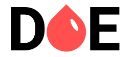

<h1 align="center">
    
    
Every donation is important

    

        
        
        <a href="https://github.com/luansoarees/maratonadev-3/stargazers">
            
        
    

</h1>

 

### :syringe: Alert

Blood donation: Why it is so important to be a donor.  
More than just helping or close, an action of blood is an act of love that can save lives and, in many cases, a transfusion is the only hope of patients

### :recycle: How to contribute

- Fork this repository;
- Create a branch with your feature: `git checkout -b my-feature`
- Commit your changes: `git commit -m 'feat: My new feature'`
- Push to your branch: `git push origin my-feature`

After the merge of your pull request is done, you can delete your branch.

---

### :memo: Licença

This project is under the MIT license. See the archive [LICENSE](LICENSE.md) for more details.

---

Done with :skull: by Luan Soares